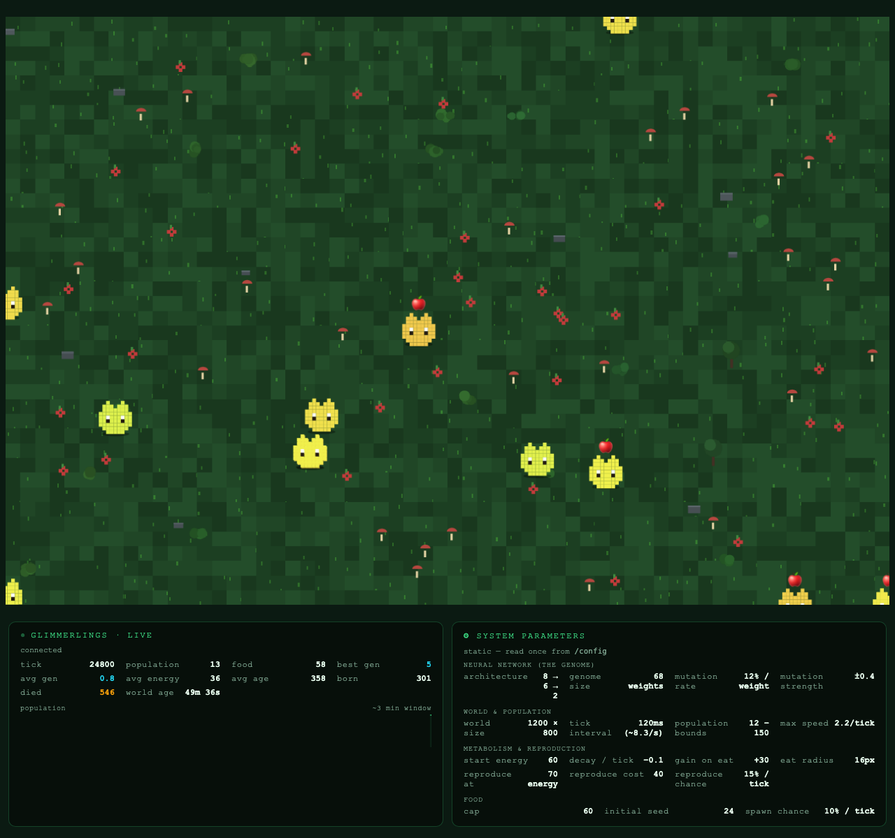
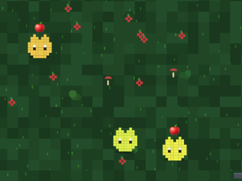

<div align="center">

# 🧬 GLIMMERLINGS

**`not scripted` · `not rendered` · `grown`**

[](LICENSE)
[](backend/package.json)
[](docker-compose.yml)
[](#-architecture)

<sub>🇬🇧 English (this section) · 🇵🇱 <a href="#polska-wersja">Polska wersja poniżej ↓</a></sub>

</div>

---

A small, closed world of digital creatures whose only inheritance is a neural network. No creature is told how to survive — each one is born with a brain shaped entirely by which of its ancestors *managed not to die*. The world never resets. It doesn't pause when no one is looking at it.

<p align="center">
  
</p>
<p align="center"><sub>A live capture of the actual running world — not a mockup. The stats panel updates every tick; the population graph fills in as you watch.</sub></p>

## 🪞 the reference point

This project is a direct answer to **[Plaything](https://en.wikipedia.org/wiki/Plaything_(Black_Mirror))** — *Black Mirror* S07E04. In it, a 1990s video game turns out to host a society of small digital beings that are, within the fiction, actually alive: not animated, not simulated for show, but running minds that experience their own continuity.

Glimmerlings doesn't claim sentience — nobody sane would. What it borrows from the episode is the one design constraint that made those creatures unsettling instead of cute: **behavior that was never hand-authored.** Every movement here is the output of a neural network forward-pass, and every network exists only because it was good enough, in a prior generation, to not starve.

## 🧠 what "alive" means here

| | Scripted ecosystem | Glimmerlings |
|---|---|---|
| decision making | `if (hungry) moveToward(food)` | forward-pass through an evolved neural net |
| what's inherited | a few numeric traits | the network's weights — the whole brain |
| what improves across generations | trait values | the *behavior itself* |
| where it lives | your browser tab | a server, continuously, whether you're watching or not |

No gradient descent, no reward function, no backprop — this is **neuroevolution**: the genome *is* the network's weights, mutation is the only source of novelty, and natural selection is the only teacher. It's a cheap, fast, honest way to make "learned to survive" literally true rather than a metaphor.

<p align="center">
  
</p>
<p align="center"><sub>Hue drift within one gold-amber species range · 🍎 hunger marker · the decorative meadow layer.</sub></p>

## 🗺️ architecture

<svg viewBox="0 0 760 400" xmlns="http://www.w3.org/2000/svg" role="img" aria-label="Glimmerlings system architecture diagram">
  <rect x="0" y="0" width="760" height="400" rx="14" fill="#05070a" stroke="#16241c" stroke-width="1"/>
  <text x="24" y="32" style="font-family:'Courier New',monospace;font-size:13px;letter-spacing:2px;fill:#3ddc84;">// SYSTEM ARCHITECTURE</text>

  <text x="420" y="72" text-anchor="middle" style="font-size:22px;">🧠</text>
  <text x="460" y="72" text-anchor="middle" style="font-size:22px;">🧠</text>
  <text x="500" y="72" text-anchor="middle" style="font-size:22px;">🧠</text>
  <text x="460" y="94" text-anchor="middle" style="font-family:'Courier New',monospace;font-size:11px;fill:#9fb8ac;">every visitor's browser</text>

  <line x1="460" y1="100" x2="460" y2="148" stroke="#3ddc84" stroke-width="1.5"/>
  <polygon points="453,140 467,140 460,150" fill="#3ddc84"/>
  <text x="468" y="128" style="font-family:'Courier New',monospace;font-size:10px;fill:#3ddc84;">ws://</text>

  <rect x="30" y="150" width="210" height="90" rx="10" fill="#0d1410" stroke="#f59e0b" stroke-width="1.5"/>
  <text x="50" y="178" style="font-family:'Courier New',monospace;font-size:14px;fill:#eafff0;">🌐 Cloudflare Tunnel</text>
  <text x="50" y="198" style="font-family:'Courier New',monospace;font-size:11px;fill:#9fb8ac;">no open router ports</text>
  <text x="50" y="214" style="font-family:'Courier New',monospace;font-size:11px;fill:#9fb8ac;">home IP stays hidden</text>

  <line x1="240" y1="195" x2="298" y2="195" stroke="#f59e0b" stroke-width="1.5"/>
  <polygon points="288,188 288,202 300,195" fill="#f59e0b"/>
  <text x="245" y="185" style="font-family:'Courier New',monospace;font-size:10px;fill:#f59e0b;">public ingress</text>

  <rect x="300" y="150" width="230" height="90" rx="10" fill="#0d1410" stroke="#3ddc84" stroke-width="1.5"/>
  <text x="320" y="178" style="font-family:'Courier New',monospace;font-size:14px;fill:#eafff0;">⚙️ Node.js engine</text>
  <text x="320" y="198" style="font-family:'Courier New',monospace;font-size:11px;fill:#9fb8ac;">world tick · neuroevolution</text>
  <text x="320" y="214" style="font-family:'Courier New',monospace;font-size:11px;fill:#9fb8ac;">WebSocket broadcast</text>

  <line x1="415" y1="240" x2="415" y2="278" stroke="#22d3ee" stroke-width="1.5"/>
  <polygon points="408,270 422,270 415,280" fill="#22d3ee"/>
  <text x="425" y="264" style="font-family:'Courier New',monospace;font-size:10px;fill:#22d3ee;">snapshot</text>

  <rect x="300" y="280" width="230" height="80" rx="10" fill="#0d1410" stroke="#22d3ee" stroke-width="1.5"/>
  <text x="320" y="306" style="font-family:'Courier New',monospace;font-size:14px;fill:#eafff0;">🗄️ PostgreSQL</text>
  <text x="320" y="324" style="font-family:'Courier New',monospace;font-size:11px;fill:#9fb8ac;">genomes · population · every 30s</text>

  <text x="24" y="384" style="font-family:'Courier New',monospace;font-size:11px;fill:#5b6d64;">one persistent world · zero resets · alive whether anyone is watching or not</text>
</svg>

- **`backend/`** — Node.js. Holds the entire world in memory and ticks it every ~120ms: creatures sense, decide (via their network), move, eat, starve, reproduce with a mutated copy of their genome. Broadcasts state to every connected client over WebSocket. Also serves `GET /config` — a one-time snapshot of the static simulation constants (network shape, mutation rate, energy/reproduction thresholds, world size), so the frontend's technical panel reads real values instead of a hand-copied, driftable duplicate.
- **`frontend/`** — static Canvas viewer. Renders only — it never simulates. Every visitor watches the same live population, not a private copy. Layout is fully fluid: the world canvas claims whatever space is left after the stats/technical panels below it, on anything from a phone to an ultrawide monitor.
- **PostgreSQL** — a full snapshot (positions, energy, genomes) every 30s, so a container restart resumes evolution instead of restarting it.
- **Cloudflare Tunnel** — the outbound-only path that makes a home server publicly reachable without opening a single port or leaking the home IP.

## ⚡ quickstart

```bash
git clone git@github.com:pi0trdotsys/glimmerlings.git
cd glimmerlings
cp .env.example .env    # set POSTGRES_PASSWORD
docker compose up --build
```

Open [`http://localhost:8080`](http://localhost:8080).

## 🛰️ going public from a home server

1. Cloudflare Zero Trust dashboard → **Networks → Tunnels → Create a tunnel → Docker**. Copy the token.
2. Paste it as `CLOUDFLARE_TUNNEL_TOKEN` in `.env`.
3. In the tunnel's **Public Hostname** config, point it at `http://backend:8080` (the service name from `docker-compose.yml`).
4. Attach your domain to the tunnel from the same dashboard.
5. `docker compose up -d` on the box that never sleeps.

Simulation cost stays flat regardless of viewer count — only the WebSocket broadcast scales with audience, and that's cheap.

## 🧬 the genome, precisely

- **inputs** → direction/distance to nearest food, current energy, direction/distance to nearest neighbor
- **outputs** → movement vector
- **genome** → the network's weights, flattened into one array
- **reproduction** → copy parent genome → mutate → done (asexual, for now)
- **selection** → genomes that keep their creature fed and un-eaten-by-nothing get to reproduce; the rest simply stop appearing in the next broadcast

## 🧭 roadmap

- [x] neuroevolved brains replacing hand-coded behavior
- [x] persistent, server-authoritative world
- [x] pixel-art creatures with live mood indicators (🍎 hungry · ❤️ just fed · ✨ newborn)
- [ ] two-parent crossover, not just mutation
- [x] a live stats panel (avg energy/age/generation, food, births/deaths) with a population sparkline
- [ ] click a creature → inspect its genome live
- [ ] optional gradient-based RL path once neuroevolution plateaus

## 📜 license

[MIT](LICENSE) — do whatever you want with it.

---

<div align="center">

*Whether any of this counts as "alive" is, appropriately, still an open question.*

</div>

<br>
<br>

<a name="polska-wersja"></a>

<div align="center">

# 🧬 GLIMMERLINGS — po polsku

**`nie skryptowane` · `nie renderowane` · `wyhodowane`**

<sub>🇵🇱 Polski (ta sekcja) · 🇬🇧 <a href="#-glimmerlings">English version above ↑</a></sub>

</div>

---

Mały, zamknięty świat cyfrowych istot, których jedynym dziedzictwem jest sieć neuronowa. Żadne stworzenie nie dostaje instrukcji, jak przetrwać — każde rodzi się z mózgiem ukształtowanym wyłącznie przez to, który z jego przodków *nie zdążył umrzeć*. Świat nigdy się nie resetuje. Nie zatrzymuje się, kiedy nikt na niego nie patrzy.

<p align="center">
  
</p>
<p align="center"><sub>Prawdziwy zrzut z działającego świata — nie makieta. Panel statystyk aktualizuje się co tick, a wykres populacji zapełnia się w miarę oglądania.</sub></p>

## 🪞 punkt odniesienia

Ten projekt to bezpośrednia odpowiedź na **[Bawidełko](https://en.wikipedia.org/wiki/Plaything_(Black_Mirror))** (*Plaything*) — odcinek S07E04 *Black Mirror*. Gra wideo z lat 90. okazuje się gospodarzem społeczności małych cyfrowych istot, które w świecie serialu są naprawdę żywe: nie animowane na pokaz, tylko działające umysły doświadczające własnej ciągłości.

Glimmerlings nie twierdzi, że jest świadomy — nikt przy zdrowych zmysłach by tak nie powiedział. To, co zapożycza z odcinka, to jedno konkretne założenie projektowe, które sprawiło, że te istoty były niepokojące, a nie tylko urocze: **zachowanie nigdy nie zostało zaprogramowane ręcznie.** Każdy ruch tutaj to wynik przejścia przez sieć neuronową, a każda taka sieć istnieje tylko dlatego, że w poprzednim pokoleniu wystarczyła, żeby nie zagłodzić się na śmierć.

## 🧠 co znaczy tu "żywe"

| | Ekosystem skryptowany | Glimmerlings |
|---|---|---|
| podejmowanie decyzji | `if (głodny) idźDo(jedzenie)` | przejście przez wyewoluowaną sieć neuronową |
| co jest dziedziczone | kilka liczbowych cech | wagi sieci — cały mózg |
| co poprawia się w kolejnych pokoleniach | wartości cech | samo *zachowanie* |
| gdzie to żyje | Twoja karta przeglądarki | serwer, nieprzerwanie, niezależnie od tego, czy patrzysz |

Żadnego gradientu, żadnej funkcji nagrody, żadnego backpropu — to **neuroewolucja**: genom *jest* wagami sieci, mutacja to jedyne źródło nowości, a dobór naturalny to jedyny nauczyciel. To tani, szybki i uczciwy sposób, żeby "nauczyło się przetrwać" było dosłownym faktem, a nie metaforą.

<p align="center">
  
</p>
<p align="center"><sub>Dryf odcienia w jednym, złoto-bursztynowym paśmie gatunkowym · 🍎 znacznik głodu · dekoracyjna warstwa polany.</sub></p>

## 🗺️ architektura

*(diagram — patrz sekcja "🗺️ architecture" w wersji angielskiej powyżej ↑ — jest czysto techniczny, więc nie tłumaczę go osobno)*

- **`backend/`** — Node.js. Trzyma cały świat w pamięci i tyka co ~120ms: stworzenia wyczuwają otoczenie, decydują (przez swoją sieć), poruszają się, jedzą, głodują, rozmnażają się z zmutowaną kopią genomu. Rozgłasza stan do każdego podłączonego klienta przez WebSocket. Serwuje też `GET /config` — jednorazowy zrzut statycznych parametrów symulacji (kształt sieci, tempo mutacji, progi energii/reprodukcji, rozmiar świata), dzięki czemu panel techniczny na froncie pokazuje realne wartości zamiast ręcznie przepisanej, podatnej na rozjazd kopii.
- **`frontend/`** — statyczny widok Canvas. Tylko renderuje — nigdy nie liczy symulacji. Każdy odwiedzający ogląda tę samą, żywą populację, nie prywatną kopię. Układ jest w pełni płynny: canvas świata zajmuje tyle miejsca, ile zostanie po panelach statystyk/technicznym pod nim — od telefonu po ultrapanoramiczny monitor.
- **PostgreSQL** — pełny snapshot (pozycje, energia, genomy) co 30s, więc restart kontenera wznawia ewolucję zamiast zaczynać ją od nowa.
- **Cloudflare Tunnel** — połączenie wyłącznie wychodzące, dzięki któremu domowy serwer jest publicznie dostępny bez otwierania jakiegokolwiek portu i bez ujawniania domowego adresu IP.

## ⚡ szybki start

```bash
git clone git@github.com:pi0trdotsys/glimmerlings.git
cd glimmerlings
cp .env.example .env    # ustaw POSTGRES_PASSWORD
docker compose up --build
```

Otwórz [`http://localhost:8080`](http://localhost:8080).

## 🛰️ wystawienie na świat z domowego serwera

1. Panel Cloudflare Zero Trust → **Networks → Tunnels → Create a tunnel → Docker**. Skopiuj token.
2. Wklej go jako `CLOUDFLARE_TUNNEL_TOKEN` w `.env`.
3. W konfiguracji **Public Hostname** tunelu wskaż `http://backend:8080` (nazwa usługi z `docker-compose.yml`).
4. Podłącz swoją domenę do tunelu w tym samym panelu.
5. `docker compose up -d` na maszynie, która nigdy nie zasypia.

Koszt symulacji jest stały niezależnie od liczby widzów — skaluje się tylko rozgłaszanie przez WebSocket, a to jest tanie.

## 🧬 genom, dokładnie

- **wejścia** → kierunek/odległość do najbliższego jedzenia, aktualna energia, kierunek/odległość do najbliższego sąsiada
- **wyjścia** → wektor ruchu
- **genom** → wagi sieci, spłaszczone do jednej tablicy
- **rozmnażanie** → kopia genomu rodzica → mutacja → gotowe (na razie bezpłciowe)
- **selekcja** → genomy, które utrzymują swoje stworzenie najedzone i nieużarte przez nic, dostają szansę na reprodukcję; reszta po prostu przestaje pojawiać się w kolejnym rozgłoszeniu

## 🧭 plan rozwoju

- [x] wyewoluowane mózgi zamiast zaprogramowanego ręcznie zachowania
- [x] trwały świat autorytatywny po stronie serwera
- [x] pikselowe istoty z żywymi wskaźnikami nastroju (🍎 głodny · ❤️ najedzony · ✨ nowo narodzony)
- [ ] krzyżowanie dwojga rodziców, nie tylko mutacja
- [x] panel statystyk na żywo (śr. energia/wiek/generacja, jedzenie, narodziny/zgony) z wykresem populacji
- [ ] kliknięcie w istotę → podgląd jej genomu na żywo
- [ ] opcjonalna ścieżka RL oparta na gradiencie, gdy neuroewolucja osiągnie plateau

## 📜 licencja

[MIT](LICENSE) — rób z tym, co chcesz.

---

<div align="center">

*Czy cokolwiek z tego liczy się jako "żywe", pozostaje — stosownie — pytaniem otwartym.*

</div>
